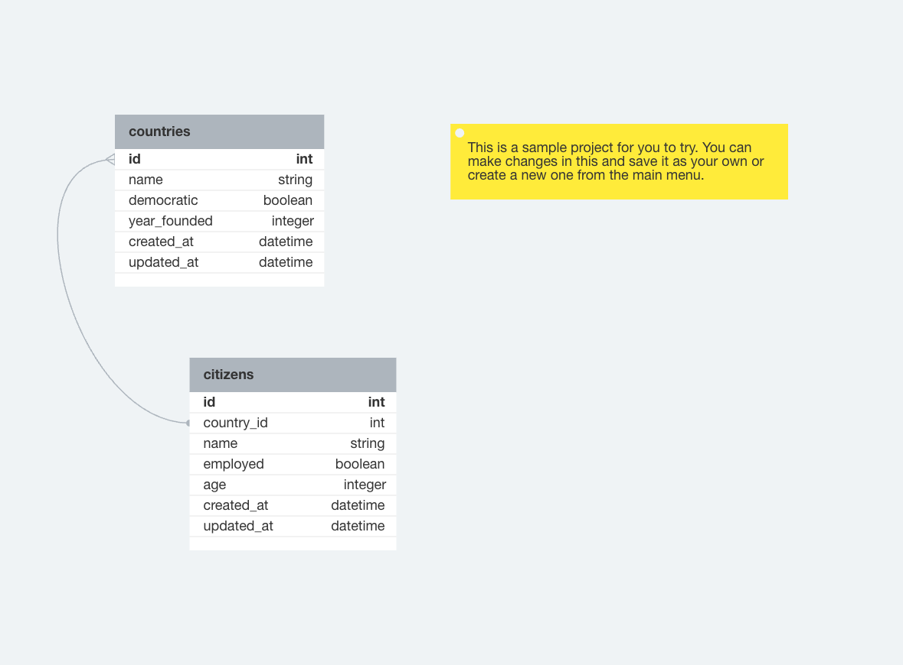

# README

This README would normally document whatever steps are necessary to get the
application up and running.

Things you may want to cover:

* Ruby version

* System dependencies

* Configuration

* Database creation

* Database initialization

* How to run the test suite

* Services (job queues, cache servers, search engines, etc.)

* Deployment instructions

* ...

[ ] done

Iteration 1
User Story 1, Country Index 

For each country table
As a visitor
When I visit '/countries'
Then I see the name of each country record in the system

[ ] done

User Story 2, Countries Show 

As a visitor
When I visit '/countries/:id'
Then I see the citizen with that id including the countries' attributes
(data from each column that is on the countries table)

[ ] done

User Story 3, Citizen Index 

As a visitor
When I visit '/citizens'
Then I see each Citizen in the system including the Citizen's attributes
(data from each column that is on the citizens table)

[ ] done

User Story 4, Citizen Show 

As a visitor
When I visit '/Citizens/:id'
Then I see the Citizen with that id including the Citizen's attributes
(data from each column that is on the Citizen table)
[ ] done

User Story 5, Country Citizen Index 

As a visitor
When I visit '/Countries/:Country_id/Citizens'
Then I see each Citizen that is associated with that Country's with each Citizen's attributes
(data from each column that is on the Citizen table)

User Story 6, Country Index sorted by Most Recently Created 

As a visitor
When I visit the Country index,
I see that records are ordered by most recently created first
And next to each of the records I see when it was created

[ ] done

User Story 7, Country citizen Count

As a visitor
When I visit a Country's show page
I see a count of the number of citizen's associated with this Country

User Story 8, Citizen Index Link

As a visitor
When I visit any page on the site
Then I see a link at the top of the page that takes me to the Citizen Index
[ ] done

User Story 9, Country Index Link

As a visitor
When I visit any page on the site
Then I see a link at the top of the page that takes me to the Country Index
[ ] done

User Story 10, Country Citizen Index Link

As a visitor
When I visit a Country's show page ('/Countries/:id')
Then I see a link to take me to that Country's `Citizens` page ('/Countries/:id/Citizens')

Iteration 2

CRUD
[ ] done

User Story 11, Country Creation 

As a visitor
When I visit the Country Index page
Then I see a link to create a new Country record, "New Country"
When I click this link
Then I am taken to '/Countries/new' where I  see a form for a new Country record
When I fill out the form with a new Country's attributes:
And I click the button "Create Country" to submit the form
Then a `POST` request is sent to the '/Countries' route,
a new Country record is created,
and I am redirected to the Country Index page where I see the new Country displayed.

[ ] done

User Story 12, Parent Update 

As a visitor
When I visit a Country show page
Then I see a link to update the Country "Update Country"
When I click the link "Update Country"
Then I am taken to '/Countrys/:id/edit' where I  see a form to edit the Country's attributes:
When I fill out the form with updated information
And I click the button to submit the form
Then a `PATCH` request is sent to '/Countrys/:id',
the Country's info is updated,
and I am redirected to the Country's Show page where I see the Country's updated info
[ ] done

User Story 13, Parent Child Creation 

As a visitor
When I visit a Parent Children Index page
visit 
Then I see a link to add a new adoptable child for that parent "Create Child"
When I click the link
I am taken to '/parents/:parent_id/child_table_name/new' where I see a form to add a new adoptable child
When I fill in the form with the child's attributes:
And I click the button "Create Child"
Then a `POST` request is sent to '/parents/:parent_id/child_table_name',
a new child object/row is created for that parent,
and I am redirected to the Parent Childs Index page where I can see the new child listed
[ ] done

User Story 14, Child Update 

As a visitor
When I visit a Child Show page
Then I see a link to update that Child "Update Child"
When I click the link
I am taken to '/child_table_name/:id/edit' where I see a form to edit the child's attributes:
When I click the button to submit the form "Update Child"
Then a `PATCH` request is sent to '/child_table_name/:id',
the child's data is updated,
and I am redirected to the Child Show page where I see the Child's updated information
ActiveRecord
[ ] done

User Story 15, Child Index only shows `true` Records 

As a visitor
When I visit the child index
Then I only see records where the boolean column is `true`
[ ] done

User Story 16, Sort Parent's Children in Alphabetical Order by name 

As a visitor
When I visit the Parent's children Index Page
Then I see a link to sort children in alphabetical order
When I click on the link
I'm taken back to the Parent's children Index Page where I see all of the parent's children in alphabetical order
Usability
[ ] done

User Story 17, Parent Update From Parent Index Page 

As a visitor
When I visit the parent index page
Next to every parent, I see a link to edit that parent's info
When I click the link
I should be taken to that parent's edit page where I can update its information just like in User Story 12
[ ] done

User Story 18, Child Update From Childs Index Page 

As a visitor
When I visit the `child_table_name` index page or a parent `child_table_name` index page
Next to every child, I see a link to edit that child's info
When I click the link
I should be taken to that `child_table_name` edit page where I can update its information just like in User Story 14
Iteration 3
CRUD
[ ] done

User Story 19, Parent Delete 

As a visitor
When I visit a parent show page
Then I see a link to delete the parent
When I click the link "Delete Parent"
Then a 'DELETE' request is sent to '/parents/:id',
the parent is deleted, and all child records are deleted
and I am redirected to the parent index page where I no longer see this parent
[ ] done

User Story 20, Child Delete 

As a visitor
When I visit a child show page
Then I see a link to delete the child "Delete Child"
When I click the link
Then a 'DELETE' request is sent to '/child_table_name/:id',
the child is deleted,
and I am redirected to the child index page where I no longer see this child
ActiveRecord
[ ] done

User Story 21, Display Records Over a Given Threshold 

As a visitor
When I visit the Parent's children Index Page
I see a form that allows me to input a number value
When I input a number value and click the submit button that reads 'Only return records with more than `number` of `column_name`'
Then I am brought back to the current index page with only the records that meet that threshold shown.
Usability
[ ] done

User Story 22, Parent Delete From Parent Index Page 

As a visitor
When I visit the parent index page
Next to every parent, I see a link to delete that parent
When I click the link
I am returned to the Parent Index Page where I no longer see that parent
[ ] done

User Story 23, Child Delete From Childs Index Page 

As a visitor
When I visit the `child_table_name` index page or a parent `child_table_name` index page
Next to every child, I see a link to delete that child
When I click the link
I should be taken to the `child_table_name` index page where I no longer see that child
Extensions
[ ] done

Extension 1: Sort Parents by Number of Children 

As a visitor
When I visit the Parents Index Page
Then I see a link to sort parents by the number of `child_table_name` they have
When I click on the link
I'm taken back to the Parent Index Page where I see all of the parents in order of their count of `child_table_name` (highest to lowest) And, I see the number of children next to each parent name
[ ] done

Extension 2: Search by name (exact match)

As a visitor
When I visit an index page ('/parents') or ('/child_table_name')
Then I see a text box to filter results by keyword
When I type in a keyword that is an exact match of one or more of my records and press the Search button
Then I only see records that are an exact match returned on the page
[ ] done

Extension 3: Search by name (partial match)

As a visitor
When I visit an index page ('/parents') or ('/child_table_name')
Then I see a text box to filter results by keyword
When I type in a keyword that is an partial match of one or more of my records and press the Search button
Then I only see records that are an partial match returned on the page

This functionality should be separate from your exact match functionality.